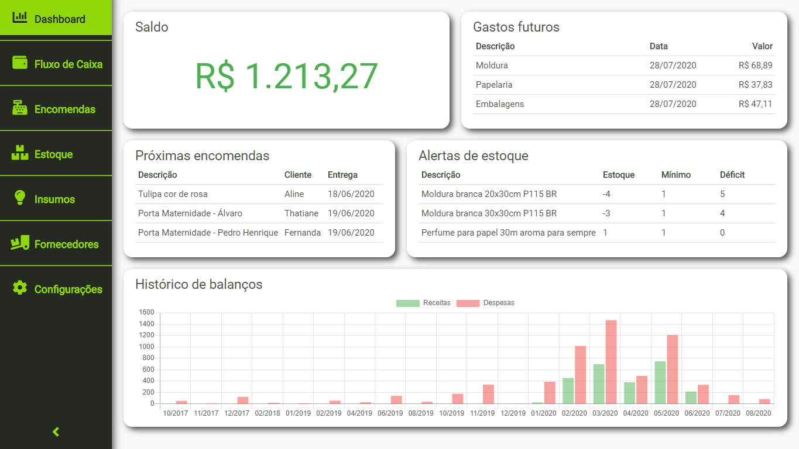

# Gestor Empresarial

Este projeto é referente a um sistema para gestão empresarial voltado para microempreendedores individuais, disponibilizando as seguintes funcionalidades:
* Fluxo de caixa
* Controle de insumos
* Controle de estoque
* Controle de fornecedores
* Controle de encomendas



## Instruções

Essas instruções lhe orientarão a baixar o código fonte, construir e executar o projeto para fins de desenvolvimento e testes. Para realizar a implantação, vá para a seção *Implantação*.

### Pré-requisitos

Será necessário instalar os seguintes pré-requisitos:
* [NodeJS](https://nodejs.org) (versão 12.14.0 ou superior)
* [Git SCM](https://git-scm.com/) (versão 2.24.1 ou superior)

### Ambiente de desenvolvimento

1. Clone o projeto
```
git clone https://github.com/fabianoww/gestor-empresarial.git
```

2. Instale as dependências
```
cd gestor-empresarial
npm install
```

3. Execute a aplicação
```
npm start
```

## Implantação

Essas instuções lhe orientarão a gerar os artefatos para execução da aplicação "em produção".

### Construindo os artefatos
```
rm -r dist
npm run dist
```

### Distribuição

O instalador da aplicação estará disponível em *dist/gestor-empresarial Setup 1.0.0.exe*.

### Instalação

Execute o instalador na máquina que será utilizada pelo usuário. Após a instalação, execute o programa *gestor-empresarial*.

## Autores

* **Fabiano Oliveira**

## Licença

Este projeto é licensiado sobre a licença [GPL-3.0 License](https://github.com/fabianoww/gestor-empresarial/blob/master/LICENSE).

## Contribuição

Este software é *open-source*, sendo seu uso totalmente gratuito. Se ele foi útil e se quiser agradecer de alguma forma, clique no botão abaixo e me pague um café!

<a href="https://www.buymeacoffee.com/fabianooliveira" target="_blank"></a>
